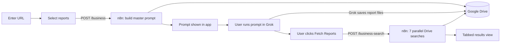

# Dept E: Enchanted Intelligence (Performance Marketing Research Suite)

A fairycore-themed web app on top of an n8n workflow that turns any website URL into up to **seven marketing research reports** covering business analysis, audience, keywords, competitors, backlinks, SEO and ad creatives. It generates a single ready-to-run Grok prompt, collects the finished reports from Google Drive, and shows them in a tabbed reader.

Enter a URL, pick the reports you want, run one prompt in Grok, and read everything in one place. There is no manual "Execute workflow" clicking in n8n.

> Part of a set of n8n-powered department tools for a digital marketing agency. This repo is the **Performance Marketing (Paid Ads + SEO)** tool.

---

## What it does

1. **Takes a website URL** and lets you choose any combination of seven reports.
2. **Builds a master Grok prompt** in n8n. The prompt tells Grok to browse the live site (not just the homepage), produce only the selected reports, and save each one as a named `.txt` file to Google Drive.
3. **Shows the prompt** in the app with a one-click copy and step-by-step instructions for running it in [grok.com](https://grok.com).
4. **Fetches the finished reports** from Drive through a second n8n webhook once Grok is done.
5. **Displays them** in a tabbed results panel, each with a copy-to-clipboard button.

### The seven reports

| Report | Covers | Grok output file |
|---|---|---|
| Business Analysis | Company overview, business model, products/services, UVP, SWOT, brand positioning, opportunities | `business_output.txt` |
| Audience Research | Primary/secondary audience, demographics, interests, pain points, personas, buying behaviour | `audience_output.txt` |
| Keyword Research | Primary, secondary and long-tail keywords, search intent, keyword clusters, content opportunities | `keyword_output.txt` |
| Competitor Discovery | Direct/indirect competitors, strengths, weaknesses, market gaps, differentiation | `competitor_output.txt` |
| Backlink Opportunities | High-authority sites, guest posts, resource pages, directories, broken-link and partnership prospects | `backlink_output.txt` |
| SEO Analysis | Technical SEO, meta titles/descriptions, heading hierarchy, internal linking, content quality | `seo_output.txt` |
| Ad Creative Variants | Google, Facebook, Instagram and LinkedIn ads: headlines, primary text, CTAs, creative ideas | `ad_output.txt` |

## Architecture



## Tech stack

- **Frontend:** vanilla HTML, CSS and JavaScript (no build step)
- **Automation:** n8n (webhooks, Code nodes, Google Drive nodes)
- **Research engine:** Grok (manual step via grok.com, with web browsing)
- **Storage / handoff:** Google Drive

## Repository structure

```
dept-e-performance-marketing/
├── frontend/
│   ├── index.html          # 5 screens: input, select, prompt, fetch, results
│   ├── css/
│   │   └── style.css       # Fairycore design system
│   └── js/
│       ├── config.js       # Webhook URLs and timeouts (edit this first)
│       ├── reports.js      # Report definitions: keys, labels, icons, descriptions
│       └── app.js          # UI flow, API calls, results rendering
├── n8n/
│   └── dept-e-workflow.json  # Importable n8n workflow (prompt + fetch)
└── README.md
```

## Getting started

### Prerequisites

- An n8n instance (self-hosted or cloud)
- A Google account, connected to n8n via the Google Drive OAuth2 credential
- A Grok account at [grok.com](https://grok.com) that can save files to your Google Drive

### 1. Import the n8n workflow

1. In n8n, choose **Import from file** and select `n8n/dept-e-workflow.json`.
2. Open each **Google Drive** node and select your own Google Drive credential.
3. **Activate** the workflow so the production webhook URLs (`/webhook/...`) are live.

The workflow exposes two webhooks:

| Endpoint | Method | Request body | Response |
|---|---|---|---|
| `/webhook/business` | POST | `{ "website": "https://...", "reports": ["business", "seo", ...] }` | `{ "fileName", "content", "prompt" }` (the master Grok prompt) |
| `/webhook/business-search` | POST | `{ "reports": ["business", "seo", ...] }` | `{ "data": { "business": "...", "audience": "...", ... } }` (text of each report found in Drive) |

**Prompt flow:** Webhook → Code node builds the master prompt for the selected reports → saves `grok_prompt.txt` to Drive → Respond to Webhook.

**Fetch flow:** Webhook → seven parallel Drive searches → Download → Extract from File → each result tagged with a source key → Merge → Code node builds one object → Respond to Webhook.

### 2. Configure the frontend

Edit `frontend/js/config.js`:

```js
const CONFIG = {
  WEBHOOK_ANALYSE: "https://YOUR-N8N-HOST/webhook/business",
  WEBHOOK_FETCH:   "https://YOUR-N8N-HOST/webhook/business-search",
  ANALYSE_TIMEOUT: 90000,   // ms
  FETCH_TIMEOUT:   60000,   // ms
};
```

The frontend contains no API keys. The only secrets live in your n8n credentials.

### 3. Run it

Serve the `frontend/` folder from any static server:

```bash
cd frontend
python3 -m http.server 8080
# or
npx serve .
```

Open `http://localhost:8080`. It deploys as-is to Netlify, Vercel or GitHub Pages.

## Usage

1. **Enter a website URL** (include `https://`).
2. **Select reports.** Click chips individually, or use Select all / Select none.
3. **Generate prompt.** The app calls n8n and displays the master Grok prompt.
4. **Run it in Grok.** Copy the prompt, paste it into grok.com, and wait for Grok to finish and save each file to your Drive.
5. **Fetch reports.** Come back and click the fetch button.
6. **Read and copy.** Switch between report tabs and copy any report to your clipboard.

## Configuration notes

- **Adding or renaming a report** takes changes in three places: the `REPORT_CONFIGS` object in the n8n prompt-builder Code node, a new Drive search branch in the fetch flow (plus its tagging Code node and Merge input), and the entry in `frontend/js/reports.js`.
- **Output file names must match** between the prompt (what Grok is told to save) and the Drive search terms in the fetch flow.
- **The prompt text lives in n8n.** The prompt copies in `reports.js` are reference definitions; the app uses only each report's key, label, icon and description.

## Known limitations

- **Grok is a manual step.** The user runs the prompt in grok.com and confirms completion before reports can be fetched.
- **Results are matched by filename.** If older output files with the same names exist in Drive, the fetch may return stale reports. Clear or rename them between runs.
- **All seven Drive searches always run.** The frontend filters the response to the reports you selected.
- **Report quality depends on Grok's browsing.** The prompt instructs it not to invent information, but outputs should be reviewed before client use.

## Troubleshooting

| Symptom | Fix |
|---|---|
| `Server error 404` | The workflow is not active, or you are using `/webhook-test/` URLs outside of test-listening mode. Use `/webhook/` URLs on an active workflow. |
| CORS error calling n8n | In each Webhook node, set **Options → Allowed Origins (CORS)** to your frontend origin. |
| Prompt screen shows "No prompt returned." | The Respond to Webhook node must return the Code node's output (it needs `prompt` or `content`). |
| "No matching data was returned." | Grok has not finished saving files yet, or a file name in Drive does not match the search term for that report. |
| One report tab is missing | That report's output file was not found in Drive. Check the file name Grok used against the table above. |
| Request times out | Increase `ANALYSE_TIMEOUT` / `FETCH_TIMEOUT` in `config.js`. |

## Roadmap

- Auto-poll Drive with backoff instead of the manual fetch click
- Run only the Drive searches for the selected reports
- Export all reports as a single formatted document
- Per-run folders in Drive to avoid stale-file collisions

## Author

Built by [Ananya Goel](https://github.com/Ananyag19).
